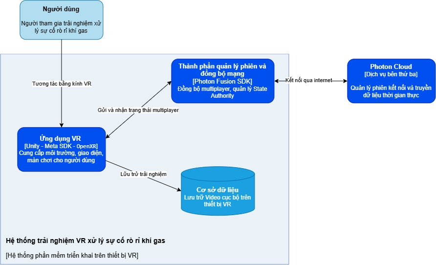

<div align="center">

# VR Fire Safety

### Multi-user VR simulation for residential gas-leak response training

**Ứng dụng mô phỏng thực tế ảo đa người dùng huấn luyện xử lý rò rỉ khí gas**

[](https://unity.com/)
[](https://www.meta.com/quest/)
[](https://www.photonengine.com/fusion)
[](LICENSE.md)

[Problem](#problem-statement) · [Architecture](#system-architecture) · [Research](#research-process) · [Results](#key-results) · [Thesis](#thesis) · [Run the project](#running-the-project)

</div>

## Overview

VR Fire Safety is a research prototype for practicing how to recognize and respond to residential LPG gas leaks and related incipient fires. It places one or more participants inside a Vietnamese home environment where they can stop a leak, ventilate the space, avoid ignition sources, use a CO₂ fire extinguisher, evacuate, and review the consequences of their decisions without exposure to real gas or fire.

The project was developed by **Bùi Hiền** and **Hồ Phú Vinh** as a 2026 undergraduate thesis at the Faculty of Information Technology, University of Science, Vietnam National University Ho Chi Minh City, under the supervision of **Dr. Lê Khánh Duy**.

## Problem statement

Residential gas leaks can cause asphyxiation, fire, or explosion, yet realistic hands-on training is dangerous, costly, and difficult to repeat at scale. Videos and printed guidance can communicate procedures but provide limited practice in recognizing hazards, coordinating with others, and seeing how unsafe actions - such as operating an electrical switch or using an open flame - change an incident. Existing VR safety applications also rarely reflect Vietnamese residential layouts and everyday gas-cylinder use. This project investigates whether a familiar, interactive, multi-user VR simulation can serve as a safe supplementary environment for introductory gas-leak response training.

> [!IMPORTANT]
> This is an educational research prototype. It is not a substitute for certified fire-safety training, professional guidance, or local emergency procedures.

## Demo

<!-- Replace each placeholder below with an image such as:
     
-->

| Single-player scenario | Multi-user coordination |
|:--:|:--:|
| _GIF/video placeholder_ | _GIF/video placeholder_ |

## Screenshots

<!-- Suggested files:
     docs/media/kitchen-scenario.png
     docs/media/fire-extinguisher.png
     docs/media/session-review.png
-->

| Residential kitchen | Fire-extinguisher interaction | Post-session review |
|:--:|:--:|:--:|
| _Screenshot placeholder_ | _Screenshot placeholder_ | _Screenshot placeholder_ |

## What the prototype includes

- Single-player and real-time multi-user sessions with room creation and joining.
- A Vietnamese residential kitchen and adjacent living spaces, with selectable day and night conditions.
- Direct VR interaction with the gas valve, stove controls, doors, windows, lights, fan, phone, lighter, and CO₂ fire extinguisher.
- Rule-based gas accumulation, ventilation, ignition, fire, smoke, explosion, exposure, and evacuation logic.
- Shared avatars, interactive objects, scenario state, time, and results synchronized through Photon Fusion.
- Audio cues, behavior-based scoring, action logs, on-device screen recording, and a post-session review timeline.
- A tutorial scene for practicing locomotion and basic object interaction.

## System architecture

<p align="center">
  
</p>

Photon Fusion Shared Mode coordinates room membership and transfers state authority for shared objects. The authoritative state is synchronized so participants observe the same gas, fire, smoke, object, timer, and session outcomes. Recordings and structured action logs remain on the VR device for review and export.

## Tech stack

| Area | Technology | Role |
|---|---|---|
| Engine | Unity `6000.1.14f1`, C# | Scenes, physics, UI, application and scenario logic |
| Rendering | Universal Render Pipeline `17.1.0` | Standalone-VR rendering and visual effects |
| XR | Meta XR All-in-One SDK `81.0.0` | Quest tracking, grabbing, controls, and interaction |
| Avatars | Meta Avatars SDK `40.0.1` | Player representation in shared sessions |
| XR standard | OpenXR Plugin `1.15.1` | Device-facing XR runtime layer |
| Networking | Photon Fusion `2.0.9` | Shared Mode rooms, state authority, RPCs, and synchronization |
| Navigation | Unity AI Navigation `2.0.9` | Navigation meshes and environment navigation support |
| Device integration | Android / Java | On-device screen-recording bridge and export workflow |
| Content pipeline | Blender and Unity assets | Residential environment, props, materials, and scenario-specific models |

## Research process

The project followed a user-centered, iterative process:

1. **Problem and literature review** - identify residential LPG hazards, safe and unsafe actions, and gaps in existing VR safety training.
2. **Professional consultation** - review the scenario and response sequence with people experienced in fire prevention, firefighting, and practical training.
3. **Requirements definition** - map each training action to interactions, environment changes, feedback, scoring rules, and recorded data.
4. **Prototype design** - build the Vietnamese residential environment and implement grabbing, rotating, pulling, pressing, and equipment use.
5. **Incident simulation** - connect leak sources, ventilation, gas levels, ignition conditions, fire, smoke, exposure, and end states through transparent rules.
6. **Multi-user integration** - add rooms, avatars, object authority, and synchronized scenario state with Photon Fusion.
7. **Iterative evaluation** - run functional and device tests, collect professional feedback, then refine gas visualization, interaction, networking, feedback, and review features.
8. **User study and analysis** - combine observation, pre/post questionnaires, SUS, interviews, action records, and technical issue logs.

## Key results

The final evaluation provides evidence of **initial feasibility and usability**, not proof of real-world skill transfer.

| Measure | Result |
|---|---:|
| Observed VR sessions | 17 |
| Scenario completion | 15/17 (**88.2%**) |
| Independent completion | 6/17 |
| Mean completion time among completed sessions | **130.1 s** |
| Mean knowledge score | **7.35 → 7.94 / 9** |
| Mean self-confidence score | **2.94 → 4.00 / 5** |
| Mean System Usability Scale score | **71.32 / 100** |
| Participants rating usefulness, session length, and willingness to repeat at 4 or 5 | **17/17** |
| Participants reporting no dizziness | **12/17** |

Most assistance concerned manipulating VR objects rather than choosing a response. Direct interaction and visible consequences helped participants understand the scenario, while doors, valve rotation, two-handed extinguisher use, locomotion, and occasional synchronization faults remained the main usability issues.

## Limitations

- The study used a small, non-randomized sample and was designed as an initial evaluation, not a controlled effectiveness trial.
- Results do not establish long-term retention or transfer of VR performance to real emergencies.
- The prototype represents one residential layout and one primary kitchen gas-leak scenario.
- Gas, fire, and smoke use rule-based abstractions rather than computational fluid dynamics or full physical simulation.
- Object interaction is not yet consistently natural, especially for doors, the gas valve, grasp transfer, and two-handed fire-extinguisher use.
- Network state, collision, locomotion, audio, and fire propagation can still interfere with a session.
- Multi-user mode does not yet assign explicit roles or measure each participant's contribution comprehensively.
- Conventional VR cannot reproduce gas odor, object weight, resistance, heat, or the full sensory pressure of a real incident.

## Running the project

### Requirements

- Unity Editor `6000.1.14f1`
- A Meta Quest headset; development and evaluation used Meta Quest 3
- Android Build Support installed through Unity Hub
- A Photon Fusion application ID for multi-user sessions
- Meta/Oculus project configuration for platform-dependent avatar features

### Setup

1. Clone this repository.
2. Open the repository folder in Unity Hub with Unity `6000.1.14f1`.
3. Allow Unity Package Manager to restore the packages in `Packages/manifest.json`.
4. Replace the checked-in Photon configuration with your own Photon Fusion application ID before using Multiplayer mode.
5. Open `Assets/_Project/Scenes/StartScene.unity` and confirm the enabled scenes in **Build Settings**.
6. Switch the build target to Android, connect the Quest headset, and use **Build and Run**.

The enabled application flow is `StartScene` → `MainScene` → `EndGameScene`, with `TutorialScene` available from the start experience. A packaged public demo build is not currently included.

### Known editor issue: Meta Avatars SDK

With Meta Avatars SDK `40.0.1`, Unity may crash when entering Play Mode repeatedly because `AvatarAssetsPackageCheckTrigger` runs again during assembly reload. If you encounter this issue, follow the documented [Meta Avatar Unity Editor crash workaround](ProjectPatches/MetaAvatar/README.md).

The workaround adds a `SessionState` guard so the package-asset check runs only once per Unity Editor session. It modifies a generated file under `Library/PackageCache`, so it is optional, is not tracked by Git, and may need to be reapplied after Unity refreshes or updates the package.

## Project structure

```text
Assets/_Project/
├── Scenes/                 # Start, tutorial, simulation, and review flow
├── Scripts/                # Scenario, networking, scoring, logging, and UI
├── Models/                 # Environment and interactive 3D models
├── Prefabs/                # Reusable gameplay and UI objects
├── Materials/              # URP materials
└── Textures/               # Environment, effects, props, and interface assets

Assets/Plugins/Android/     # Quest screen-recording integration
Assets/Photon/              # Photon Fusion SDK
Assets/WireBuilder/         # Third-party cable/hose construction tool
ProjectPatches/MetaAvatar/  # Reproducible workaround for a Meta SDK editor crash
docs/thesis/                # Full thesis report
docs/media/                 # README demos and screenshots
```

## Thesis

The complete translated thesis contains the theoretical background, scenario rationale, design decisions, system implementation, professional consultation, user-study method, results, and future work.

**[Read the full thesis (PDF, 28.2 MB)](docs/thesis/VR-Fire-Safety-Thesis.pdf)**

Suggested citation:

```bibtex
@misc{hien_vinh_vr_fire_safety_2026,
  author      = {Bùi Hiền and Hồ Phú Vinh},
  title       = {Multi-user VR Simulation for Gas Safety Training},
  institution = {University of Science, Vietnam National University Ho Chi Minh City},
  year        = {2026},
  type        = {Undergraduate thesis},
  supervisor  = {Lê Khánh Duy}
}
```

## Third-party work and acknowledgements

The fire-extinguisher hose was authored with [WireBuilder by `nicogarciasdev`](https://github.com/nicogarciasdev/WireBuilder), a Unity Editor tool for constructing segmented wires and cables. WireBuilder itself incorporates a TubeRenderer implementation credited upstream to Mathias Søeholm. See [THIRD_PARTY_NOTICES.md](THIRD_PARTY_NOTICES.md) before redistributing the project or its bundled dependencies and assets.

Thanks to the fire-safety professional and practical-training educator who reviewed the initial prototype, and to every participant who took part in the user study.

## License

Original project code and content owned by the authors are available under the [PolyForm Noncommercial License 1.0.0](LICENSE.md). You may use, study, modify, and redistribute those portions for permitted noncommercial purposes. **Commercial use requires prior written permission from the copyright holders.**

For commercial licensing enquiries, contact the authors through this repository.

This is a source-available, noncommercial license rather than an OSI-approved open-source license. Third-party SDKs, packages, code, models, textures, fonts, audio, and other assets remain subject to their respective owners' terms and are not relicensed by this repository.
